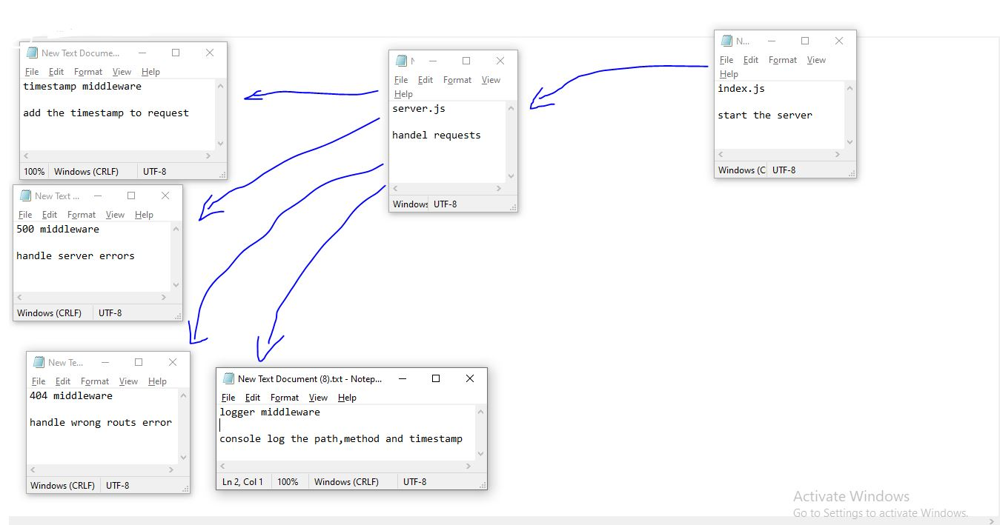

# LAB - Class 07

## Project: HTTP and REST

### Author: Ruwaid al sayyed obeid

### Links and Resources

- [submission PR](https://github.com/ruwaid-401-advanced-javascript/api-server/pull/2)
- [Github actions](https://github.com/ruwaid-401-advanced-javascript/api-server/pull/2/checks)
- [swagger hub](https://app.swaggerhub.com/apis/rowaidsayyed/ALL-CRUD-cat-pro/0.2)

### Documentaion
* EndPoint: `/docs` 

## Modules
### server.js
### logger.js
### 404.js
### 500.js
### timestamp.js

### Setup
#### .env requirements
* PORT - Port Number

#### How to initialize/run your application 
* `npm start`
* EndPoint: `/` 
* EndPoint: `/docs` 
* EndPoint: `/categories` 
* EndPoint: `/products`

#### How to use your library 
#### Tests
- Lint test: `npm run lint`
- unit test: `npm test`

#### UML

